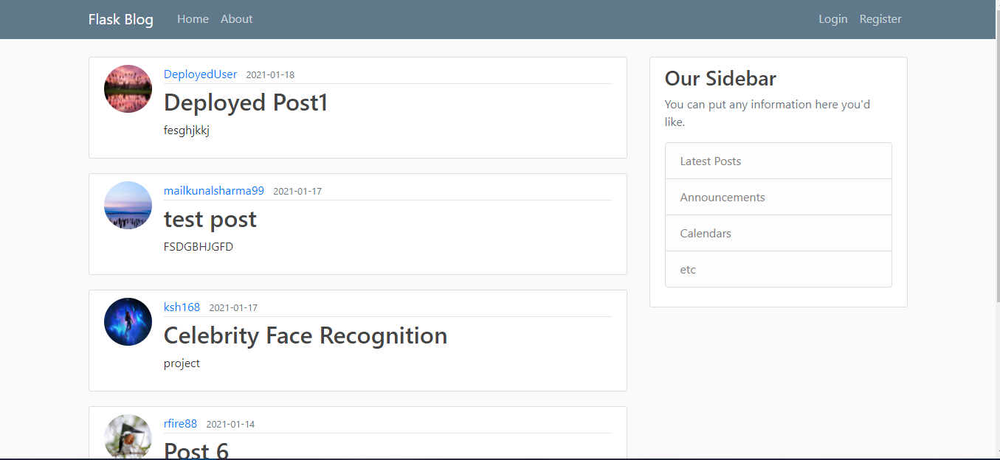

# Flask Blog

### This project can be viewed [here](http://flaskblog.eastus.cloudapp.azure.com)




* Blog website made using **Flask** and deployed on **Azure**. Uses **sqlite** database

* Passwords are encrypted using [**bcrypt**](https://www.npmjs.com/package/bcrypt)

* Profile images are compressed using [**Pillow**](https://pypi.org/project/Pillow/) before saving to db

* [**Nginx**](https://www.nginx.com/) and [**gunicorn**](https://gunicorn.org/) are used to run the server

* Website is https secured using [Let's Encrypt](https://letsencrypt.org/) certificate

### Features:

Users can:-

:white_check_mark: Register new account, login to existing one

:white_check_mark: Create, update, delete posts

:white_check_mark: Request password reset email

:white_check_mark: Change account username, email, password

:white_check_mark: Choose a custom profile picture

:white_check_mark: View posts by individual user


### Steps:

Always recommended to create a virtual environment

* Enter the virtual environment and then
```pip install -r requirements.txt```

.....


### Acknowledgments:

Inspired by [Corey M Schafer's](https://www.youtube.com/channel/UCCezIgC97PvUuR4_gbFUs5g) Flask [Tutorial](https://www.youtube.com/playlist?list=PL-osiE80TeTs4UjLw5MM6OjgkjFeUxCYH)
